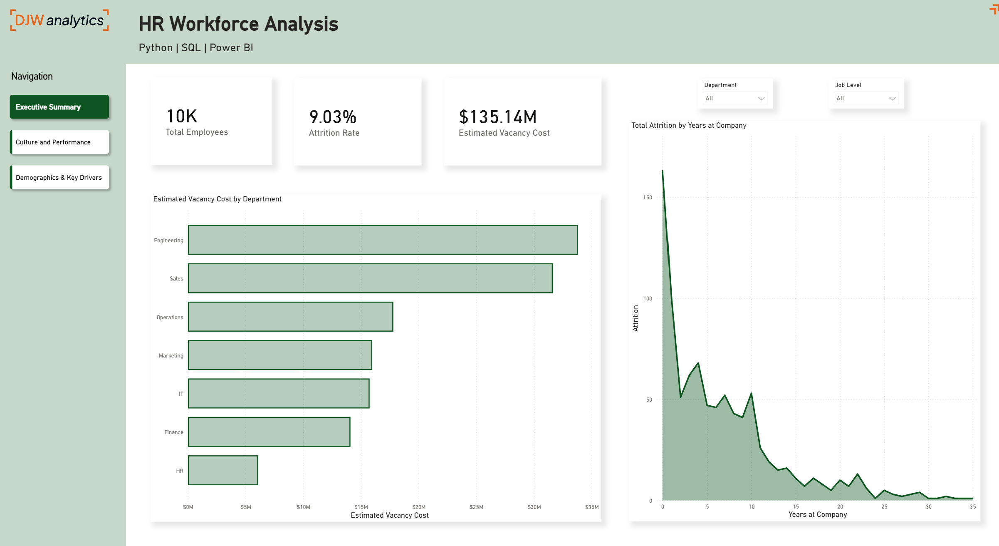

# Workforce Attrition Analysis

A workforce analytics project exploring patterns associated with employee attrition using Python, PostgreSQL, and Power BI.

## Project question

Which employee, role, and work patterns are associated with attrition, and where could retention efforts be focused?

## Dashboard

<!-- Add a screenshot here once you upload it to the repository -->

## Key findings

- Overall attrition was 9.03% across 10,000 employees.
- Engineering had the highest attrition rate of 9.58% with the HR department comparetively low at 7.27%. 
- Employees working overtime showed a 1.56x higher likely hood of attrition across all employees analysed.

These are descriptive patterns in the dataset. They do not show that any factor caused employees to leave.

## Project workflow

1. Python: cleaned and prepared the source data.
2. PostgreSQL: stored and structured the data for analysis.
3. Power BI: created the dashboard and DAX measures.

## Estimated attrition cost

The estimate applies this assumption to employees marked as having left:

`monthly income × 12 × 1.5`

The 1.5 multiplier is an assumption. This is an estimated cost proxy, not a recorded company cost.

## Repository contents

- `python/` — data preparation scripts
- `sql/` — database and transformation scripts
- `powerbi/` — Power BI report
- `images/` — dashboard screenshots

Update these folder names to match what you actually add to the repository.

## Data and limitations

- **Dataset:** [name and link]
- The data represents [source, period, and whether it is simulated or public].
- The analysis shows associations, not causes.
- Findings and recommendations should be interpreted within the limits of this dataset.

## Tools

Python · Pandas · PostgreSQL · Power BI · DAX
